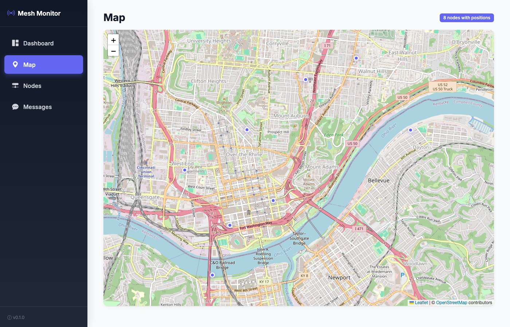
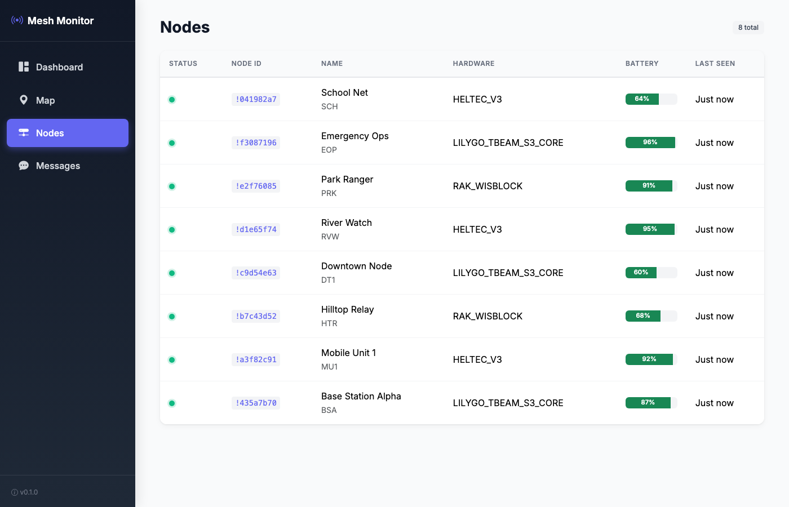
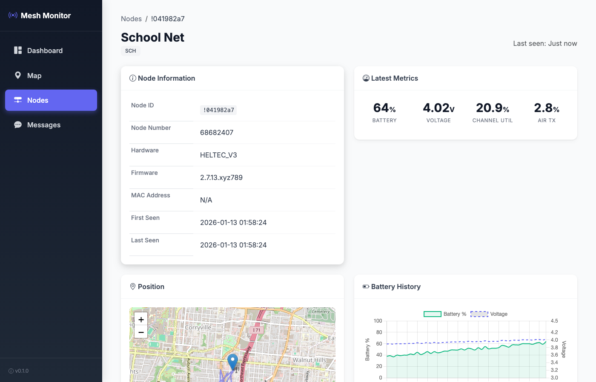
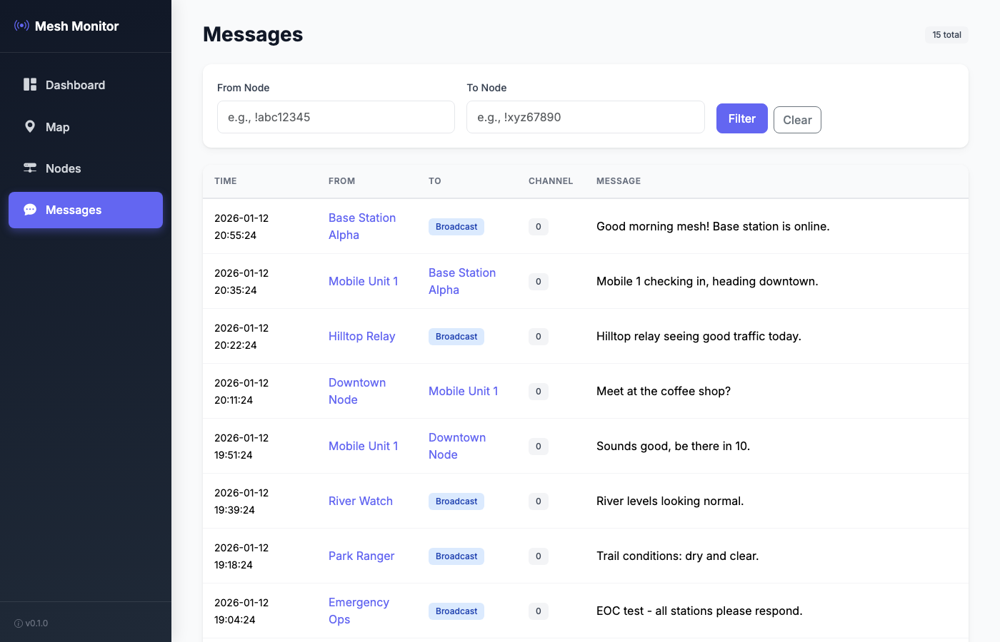

# Meshtastic Monitor

[](https://github.com/niemesrw/meshtastic-monitor/actions/workflows/docker-build.yml)
[](https://opensource.org/licenses/MIT)

An open-source application for monitoring Meshtastic mesh networks. Connects to nodes via TCP, collects network data (nodes, positions, messages, telemetry), stores it locally, and provides both CLI and Web UI for visualization.

**Self-hostable** - Run your own instance with a single Docker command. No cloud dependencies.

## Features

- **Real-time monitoring** - Connect to one or more gateway nodes and collect data continuously
- **Multi-gateway support** - Aggregate data from multiple connection points for broader mesh visibility
- **Historical storage** - All data persisted to SQLite for later analysis
- **Web UI with maps** - Visualize node positions on an interactive map
- **Metrics dashboards** - Charts for battery, channel utilization, and more
- **CLI query interface** - Terminal commands to search and filter collected data
- **Export capabilities** - Export data to JSON or CSV formats
- **Multi-arch Docker images** - Ready-to-run on x86_64, Raspberry Pi, and Apple Silicon
- **Auto-updates** - Deploy with Watchtower for automatic updates

## Quick Start (Docker)

The fastest way to get started - works on any system with Docker:

```bash
docker run -d \
  --name mesh-monitor \
  --restart unless-stopped \
  -p 8080:8080 \
  -v mesh-data:/data \
  -e MESHTASTIC_HOST=192.168.1.100 \
  ghcr.io/niemesrw/meshtastic-monitor:latest
```

Open `http://localhost:8080` to access the web UI.

## Quick Start (Python)

```bash
# Clone the repository
git clone https://github.com/niemesrw/meshtastic-monitor.git
cd meshtastic-monitor

# Install with pip (or use: uv pip install -e .)
pip install -e .

# Start monitoring with web UI
mesh-monitor start --host 192.168.1.100 --web
```

## Requirements

- **Docker** (recommended) - Works on any platform
- **Or** Python 3.9+ for native installation
- Meshtastic node(s) accessible via TCP/IP (WiFi enabled)

## CLI Usage

### Start Monitoring

```bash
# Single gateway
mesh-monitor start --host 192.168.10.190

# Multiple gateways
mesh-monitor start --host 192.168.10.190 --host 192.168.10.191

# With web UI
mesh-monitor start --host 192.168.10.190 --web

# Specify database file
mesh-monitor start --host 192.168.10.190 --db mynetwork.db
```

Press `Ctrl+C` to stop monitoring.

### Query Data

```bash
# List all discovered nodes
mesh-monitor nodes

# Show details for a specific node
mesh-monitor node !435a7b70

# View position history
mesh-monitor positions !435a7b70 --limit 20

# View device metrics history
mesh-monitor metrics !435a7b70 --limit 20

# View messages
mesh-monitor messages
mesh-monitor messages --from !435a7b70
mesh-monitor messages --limit 50

# Show database status
mesh-monitor status
```

### Export Data

```bash
# Export to JSON
mesh-monitor export --format json --output mesh-data.json

# Export to CSV
mesh-monitor export --format csv --output mesh-data.csv
```

## Web UI

### Start with Web UI

```bash
# Start collector and web server together
mesh-monitor start --host 192.168.10.190 --web

# Access the web UI at http://localhost:8080
```

### Web UI Only (View Historical Data)

```bash
# Browse existing data without live collection
mesh-monitor web --db mesh.db --port 8080
```

### Screenshots

**Dashboard** - Network overview with stats and recent activity


**Map View** - Interactive map showing all node positions



**Nodes List** - All discovered nodes with status and battery levels



**Node Detail** - Per-node view with position history and metrics charts



**Messages** - Searchable message log with filters



### Web UI Views

| View | URL | Description |
|------|-----|-------------|
| Dashboard | `/` | Network stats, recent activity, health indicators |
| Map | `/map` | Interactive map with all node positions |
| Nodes | `/nodes` | Sortable table of all discovered nodes |
| Node Detail | `/nodes/<id>` | Single node info, position history, metrics charts |
| Messages | `/messages` | Searchable message log with filters |

## CLI Reference

| Command | Description |
|---------|-------------|
| `start` | Start monitoring gateway node(s) |
| `web` | Start web UI server only |
| `nodes` | List all discovered mesh nodes |
| `node <id>` | Show details for a specific node |
| `positions <id>` | Show position history for a node |
| `metrics <id>` | Show device metrics history for a node |
| `messages` | Show message history |
| `status` | Show connection and database statistics |
| `export` | Export collected data |

### Global Options

| Option | Description |
|--------|-------------|
| `--db PATH` | Path to SQLite database (default: `mesh.db`) |
| `--help` | Show help message |

## Data Collected

### Nodes
- Node ID and numeric identifier
- Long name and short name
- Hardware model and firmware version
- First seen and last heard timestamps

### Positions
- Latitude, longitude, altitude
- Location source (GPS, manual, etc.)
- Timestamp of each position update

### Device Metrics
- Battery level and voltage
- Channel utilization
- Airtime TX utilization
- Device uptime

### Messages
- Sender and recipient
- Channel
- Message text
- Timestamp

## Architecture

See [docs/architecture.md](docs/architecture.md) for detailed architecture and deployment options.

### Standalone Deployment
```
┌─────────────────────────────────────────┐
│          Docker / Native Python         │
│  ┌─────────────┐    ┌────────────────┐  │
│  │  Collector  │───▶│   SQLite DB    │  │
│  │  + Web UI   │    │                │  │
│  └──────┬──────┘    └────────────────┘  │
└─────────┼───────────────────────────────┘
          │ TCP
          ▼
   ┌──────────────┐
   │  Meshtastic  │
   │    Node      │
   └──────────────┘
```

### Distributed Deployment (Multiple Locations)
```
┌──────────────┐     ┌──────────────┐     ┌──────────────┐
│ Pi Collector │     │ Pi Collector │     │ Pi Collector │
│ (Location A) │     │ (Location B) │     │ (Location C) │
└──────┬───────┘     └──────┬───────┘     └──────┬───────┘
       │                    │                    │
       └────────────────────┼────────────────────┘
                            │ Sync
                            ▼
                 ┌─────────────────────┐
                 │   Central Server    │
                 │  (Aggregated View)  │
                 └─────────────────────┘
```

## Docker Deployment

### Quick Start with Docker

```bash
docker run -d \
  --name mesh-monitor \
  -p 8080:8080 \
  -v mesh-data:/data \
  -e MESHTASTIC_HOST=192.168.1.100 \
  ghcr.io/niemesrw/meshtastic-monitor:latest
```

### Raspberry Pi Deployment with Auto-Updates

Deploy to Raspberry Pi with automatic updates via Watchtower:

```bash
# On your Pi
mkdir ~/meshtastic && cd ~/meshtastic

# Download compose file and env template
curl -O https://raw.githubusercontent.com/niemesrw/meshtastic-monitor/main/deploy/docker-compose.pi.yml
curl -O https://raw.githubusercontent.com/niemesrw/meshtastic-monitor/main/deploy/.env.pi.example
mv .env.pi.example .env

# Edit .env with your Meshtastic device IP
nano .env

# Start the stack
docker compose -f docker-compose.pi.yml up -d
```

Watchtower will automatically pull new images when updates are pushed to GitHub.

### Available Tags

| Tag | Description |
|-----|-------------|
| `latest` | Latest build from main branch |
| `v1.0.0` | Specific version |
| `sha-abc1234` | Specific commit |

## Configuration

The tool uses sensible defaults but can be configured via command-line options:

| Option | Default | Description |
|--------|---------|-------------|
| `--db` | `mesh.db` | SQLite database file path |
| `--host` | (required) | Gateway node IP address |
| `--port` | `4403` | Meshtastic TCP port |
| `--web` | false | Start web UI alongside collector |
| `--web-port` | `8080` | Web UI port |

## Development

```bash
# Install dev dependencies
pip install -e ".[dev]"

# Run tests
pytest

# Format code
black mesh_monitor/
```

## Project Structure

```
meshtastic-monitor/
├── mesh_monitor/
│   ├── __init__.py
│   ├── __main__.py      # Entry point
│   ├── cli.py           # Click CLI commands
│   ├── db.py            # SQLite database layer
│   └── collector.py     # Meshtastic event collection
├── web/
│   ├── __init__.py
│   ├── app.py           # Flask application
│   ├── api.py           # REST API routes
│   ├── templates/       # Jinja2 HTML templates
│   │   ├── base.html
│   │   ├── dashboard.html
│   │   ├── map.html
│   │   ├── nodes.html
│   │   ├── node_detail.html
│   │   └── messages.html
│   └── static/          # CSS, JS, images
│       ├── css/
│       └── js/
├── docs/
│   └── architecture.md  # Architecture documentation
├── requirements.txt
├── setup.py
└── README.md
```

## License

MIT
